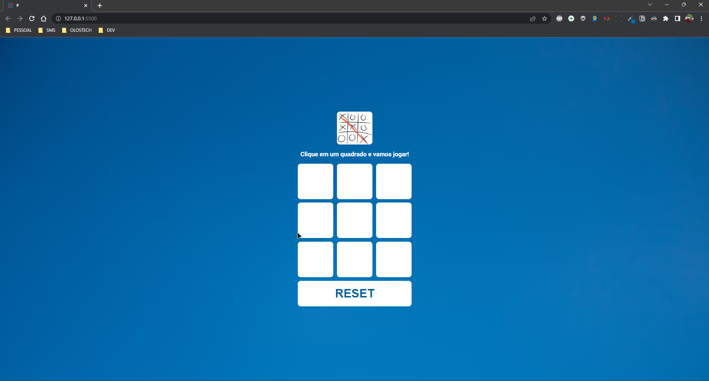
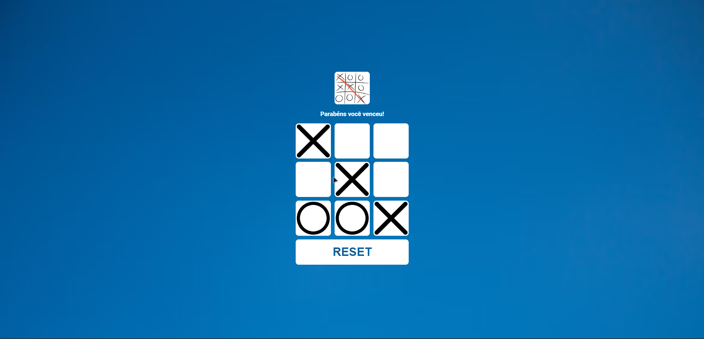
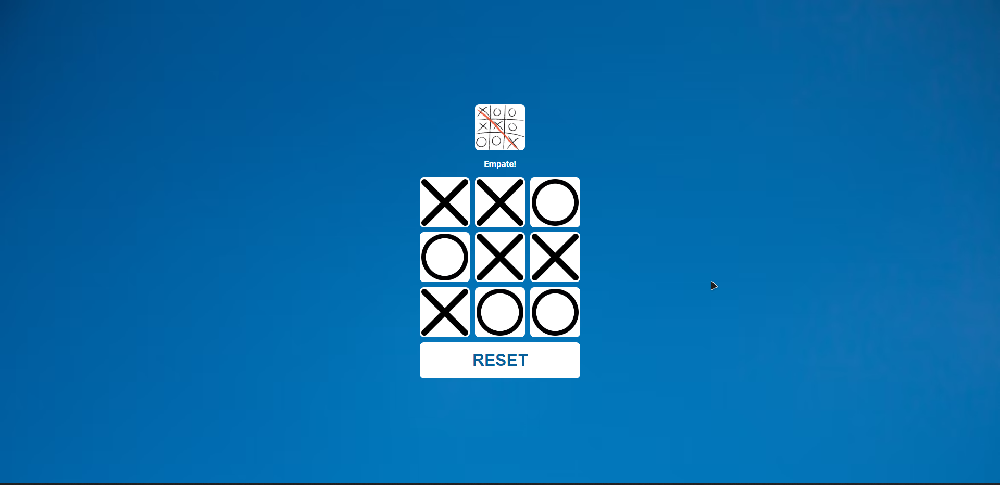
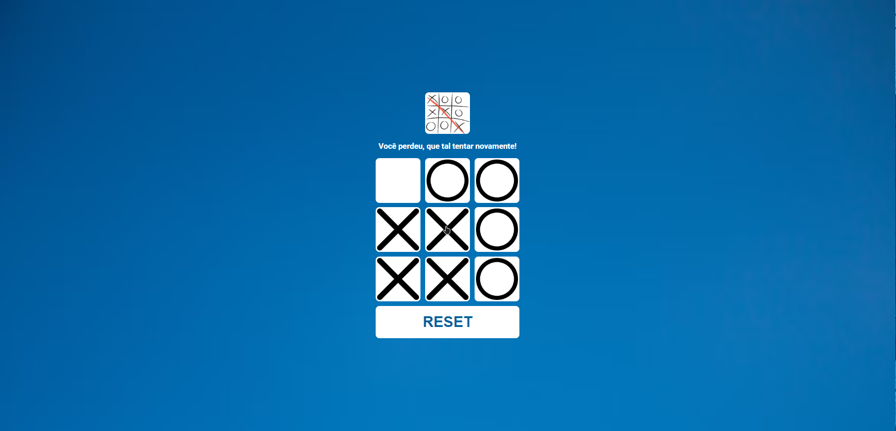

# {#} Jogo da Velha

Aplicação desenvolvida para praticar e estudar novos conceitos sobre o HTML5, CSS e JavaScript.

Na aplicação é possível competir contra um bot e durante o jogo acontece varias validações:

Verifica se você venceu o bot:

Verifica se a a partida não terminou em empate:

Verifica se você perdeu para o bot:

A aplicação poderá sofre mudanças no layout ou poderá ser implementada novas logicas.

<h2 align="center">Tecnologias utilizadas</h2>

  

